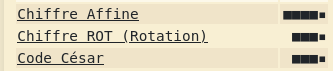

# level00

## Hint

Watching the video available on the 42intra, we can see that there is a file missing in the home directory of user `level00`, the file is a README file that should read:

> FIND this first file who can run only as flag00...

Despite the poor english, we now know we need to look for a file over which `level00` has rights to execute.

## find

The cli tool `find` is the perfect tool since the option `-user` allows for a search narrowed to the files owned by the user provided as a parameter.

Thus:

```shell-session
level00@SnowCrash:~$ find / -user flag00
``` 

or the following for the uncluttered output, rid of error messages:

```shell-session
level00@SnowCrash:~$ find / -user flag00 2>/dev/null
``` 

This displays two suspisciously similarly named files: 

```shell-session
level00@SnowCrash:~$ find / -user flag00 2>/dev/null
/usr/sbin/john 
/rofs/usr/sbin/john
``` 

## cat

If we display both of these file we can find they have the same contents:

```shell-session
level00@SnowCrash:~$ cat /usr/sbin/john
cdiiddwpgswtgt
level00@SnowCrash:~$ cat /rofs/usr/sbin/john
cdiiddwpgswtgt
```

## decoding

This looks like a password that is encrypted.
We can use our recommended ressource for decoding passwords and go on [dcode.fr](https://www.dcode.fr/identification-chiffrement).

Since there is a plethora of possible encryption methods, we can use `dcode`'s feature of encryption detection and check what method is most likely used.

The website says that it's either of the following:



And it doesn't take long to witness that `Rotation` and `Code César` give out equivalent results.

> Rotation: NOTTOOHARDHERE

> Code César: nottoohardhere

## Getflag

We can now log into the VM as user `flag00` and use password `nottoohardhere`.

Using the `getflag` command will now provide us the token allowing us to proceed to the next level!

```shell-session
flag00@192.168.152.166's password:
Don't forget to launch getflag !
flag00@SnowCrash:~$ getflag
Check flag.Here is your token : x24ti5gi3x0ol2eh4esiuxias
```
